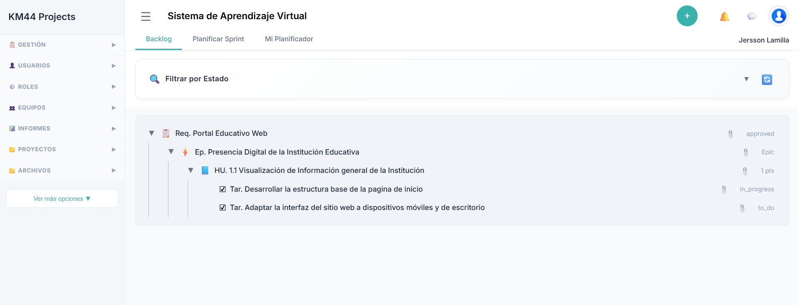

# Proyecto_sistema_aprendizaje_virtual

## Requerimiento
Req. Portal Educativo Web

## Épica
Ep. Presencia Digital de la Institución Educativa

## Historia de Usuario
HU. 1.1 Visualización de Información general de la Institución

## Tareas
- Tar. Desarrollar la estructura base de la pagina de inicio
- Tar. Adaptar la interfaz del sitio web a dispositivos móviles y de escritorio

## Evidencia

