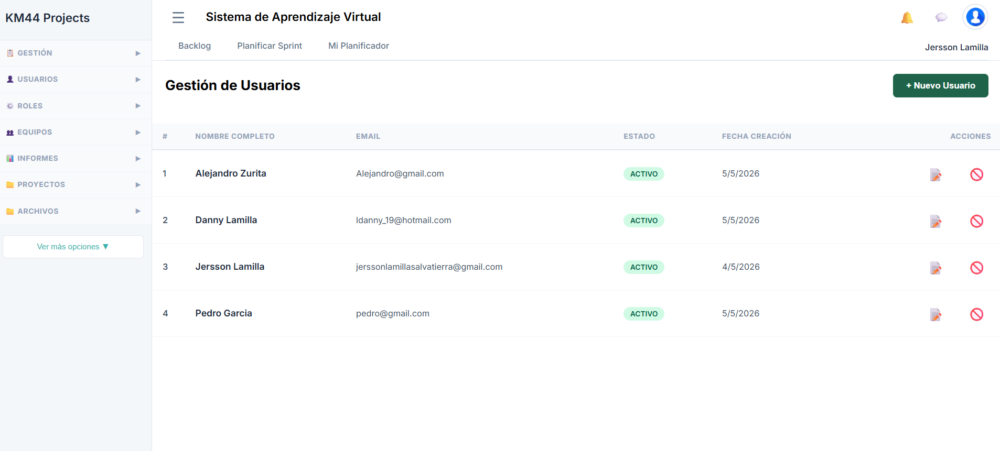
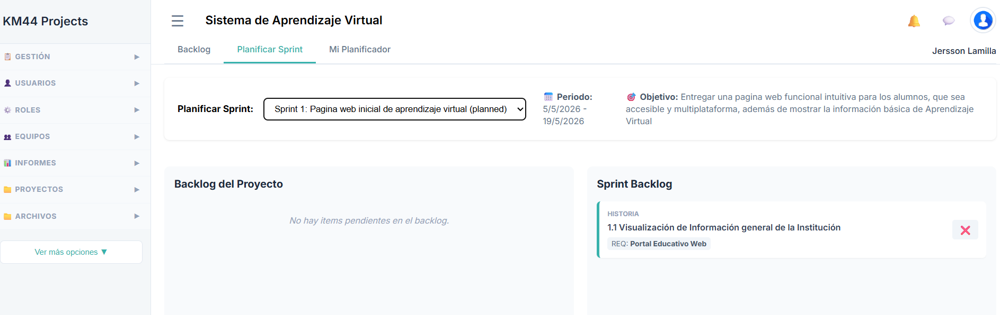
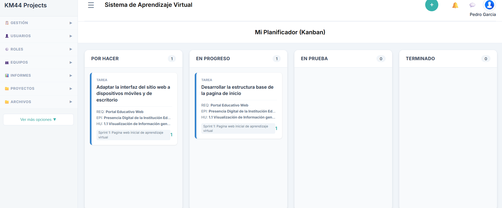

# Proyecto_sistema_aprendizaje_virtual
# Equipo de Trabajo

| Integrante | Rol |
|---|---|
| Jersson Lamilla | Administrador / Desarrollador |
| Alejandro Zurita | Scrum Master |
| Danny Lamilla | Product Owner |
| Pedro Garcia | Diseñador UI |

---

# Responsabilidades del Equipo

## Administrador / Desarrollador
Encargado de la implementación y administración del proyecto web.

## Scrum Master
Responsable de coordinar y supervisar el proceso Scrum.

## Product Owner
Responsable de definir y priorizar los requerimientos del producto.

## Diseñador UI
Encargado del diseño visual e interfaz de usuario del sistema.

## Requerimiento
Req. Portal Educativo Web

## Épica
Ep. Presencia Digital de la Institución Educativa

## Historia de Usuario
HU. 1.1 Visualización de Información general de la Institución

## Tareas
- Tar. Desarrollar la estructura base de la pagina de inicio
- Tar. Adaptar la interfaz del sitio web a dispositivos móviles y de escritorio

# Planificación del Sprint

## Sprint 1: Pagina web inicial de aprendizaje virtual

### Periodo
05/05/2026 - 19/05/2026

### Objetivo del Sprint
Entregar una pagina web funcional intuitiva para los alumnos, que sea accesible y multiplataforma, además de mostrar la información básica de Aprendizaje Virtual.

---

# Sprint Backlog

## Historia de Usuario
HU 1.1 Visualización de Información general de la Institución

### Requerimiento asociado
REQ: Portal Educativo Web

---

# Actividades del Sprint

- Desarrollar la estructura base de la pagina de inicio
- Adaptar la interfaz del sitio web a dispositivos móviles y de escritorio

# Desarrollo de Tareas

## Tarea en progreso
Desarrollar la estructura base de la pagina de inicio.

### Estado
En progreso

---

## Tarea pendiente
Adaptar la interfaz del sitio web a dispositivos móviles y de escritorio.

### Estado
Por hacer

---

# Tablero Kanban del Sprint

El tablero Kanban permite visualizar el estado de las tareas del Sprint mediante las columnas:
- Por hacer
- En progreso
- En prueba
- Terminado

Actualmente:
- 1 tarea se encuentra en progreso
- 1 tarea se encuentra pendiente

---
# Evidencia del Equipo de Trabajo

## Evidencia

# Evidencia del Sprint

# Evidencia del Diseñador UI

